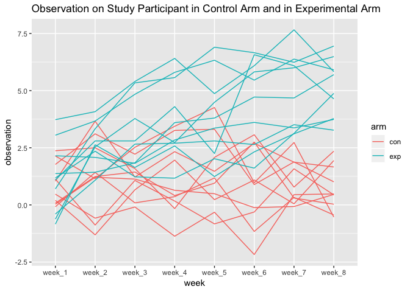
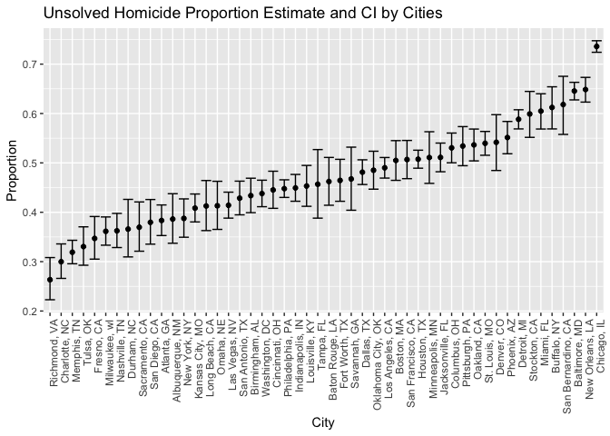

p8105\_hw5\_hy2580
================
haokun yuan
11/3/2018

``` r
knitr::opts_chunk$set(echo = TRUE)
library(tidyverse)
library(purrr)
library(rvest)
```

### Problem 1

Read files of the study

``` r
# select only study data
files = list.files("data")[-21]
  

read_file = function(x) {
  file_path = str_c("./data/",x)
  file = read_csv(file_path) %>% 
    mutate(file_name = x)
}

study_data = map_df(files, read_file)
```

Tidy Data

``` r
tidy_data = study_data %>% 
  select(file_name, everything()) %>% 
  # separate "file name"" to "arm" and "id""
  separate(file_name, into = c("arm","id"), sep = "_") %>% 
  mutate(arm_id = str_replace(id,".csv", ""),
         id = row_number()) %>% 
  gather(week, observation, week_1:week_8) 
```

Make a spaghetti plot showing observations on each subject over time, and comment on differences between groups.

``` r
tidy_data %>% 
  ggplot(aes(week, observation, group = id, color = arm)) + 
  geom_line() +
  labs(title = "Observation on Study Participant in Control Arm and in Experimental Arm")
```



The observation of participants in experimental arm appears to have an upward trend as time goes on, while participants in the control arm doesn't show significant change over time.

### Problem 2

Import raw data.

``` r
homicide_data = read_csv("./data/homicide-data.csv") %>% 
  janitor::clean_names()
```

The raw data contains 52179 observations for 12 variables, and the variables are uid, reported\_date, victim\_last, victim\_first, victim\_race, victim\_age, victim\_sex, city, state, lat, lon, disposition

Summarize total homicide and unsolved homicide within city.

``` r
city_homicide = homicide_data %>%
  mutate(city_state = paste(city, state, sep = ", ")) %>% 
  group_by(city_state) %>%
  count(disposition) %>% 
  spread(key = disposition, value = n) %>% 
  janitor::clean_names() %>% 
  # replace NA by 0
  replace_na(list(closed_by_arrest = 0, closed_without_arrest = 0, open_no_arrest = 0 )) %>%
  mutate(total_homicide = closed_by_arrest + closed_without_arrest + open_no_arrest, 
         unsolved_homicide = closed_without_arrest + open_no_arrest) %>% 
  select(city_state, total_homicide, unsolved_homicide)
```

In city\_homicide data, there are 51 observation for the three variable. However, the data were supposed only include 50 cities.

Check for abnormality.

``` r
city_homicide %>% 
  arrange(total_homicide) %>% 
  head()
```

    ## # A tibble: 6 x 3
    ## # Groups:   city_state [6]
    ##   city_state         total_homicide unsolved_homicide
    ##   <chr>                       <dbl>             <dbl>
    ## 1 Tulsa, AL                       1                 0
    ## 2 Tampa, FL                     208                95
    ## 3 Savannah, GA                  246               115
    ## 4 San Bernardino, CA            275               170
    ## 5 Durham, NC                    276               101
    ## 6 Denver, CO                    312               169

``` r
homicide_data %>% 
  mutate(city_state = paste(city, state, sep = ", ")) %>%
  filter(city == "Tulsa") %>% 
  select(city_state, lon, lat) %>% 
  arrange(city_state) %>% 
  head()
```

    ## # A tibble: 6 x 3
    ##   city_state   lon   lat
    ##   <chr>      <dbl> <dbl>
    ## 1 Tulsa, AL  -96.0  36.1
    ## 2 Tulsa, OK  -96.0  36.1
    ## 3 Tulsa, OK  -95.9  36.1
    ## 4 Tulsa, OK  -95.9  36.1
    ## 5 Tulsa, OK  -95.9  36.1
    ## 6 Tulsa, OK  -95.9  36.2

By arranging the city homicide data, it is clear that while other cities has more than 200 total\_homicide, Tulsa, AL contains only one homicide case, and through web searching, there does not exist a city named Tulsa in AL, and by looking the longtidude and latitude, Tulsa, AL has the same geographic location as Tulsa, OK. It is likely that the Al was a typo , so I decide to include the data point into Tulsa, OK.

Replace the abnormal data point.

``` r
city_homicide_adj = city_homicide %>%
  filter(city_state != "Tulsa, AL") %>% 
  mutate(total_homicide = ifelse(city_state == "Tulsa, OK", total_homicide + 1, total_homicide))
```

Get the estimated proportion and confidence intervals for the city of Baltimore, MD.

``` r
baltimore_homicide = city_homicide_adj %>% 
  filter(city_state == "Baltimore, MD")

prop.test(baltimore_homicide$unsolved_homicide,baltimore_homicide$total_homicide) %>%
    broom::tidy() %>% 
  select(estimate, conf.low, conf.high)
```

    ## # A tibble: 1 x 3
    ##   estimate conf.low conf.high
    ##      <dbl>    <dbl>     <dbl>
    ## 1    0.646    0.628     0.663

Now run prop.test for each of the cities

``` r
city_prop = city_homicide_adj %>% 
  ungroup() %>% 
  mutate(parameter = map2(city_homicide_adj$unsolved_homicide, city_homicide_adj$total_homicide, prop.test)) %>% 
  mutate(parameter = map(parameter, broom::tidy )) %>% 
  unnest() %>% 
  select(city_state, estimate, conf.low, conf.high)
```

Create a plot that shows the estimates and CIs for each city.

``` r
city_prop %>% 
  #mutate(city_state = fct_reorder(city_state),e)
  ggplot(aes(fct_reorder(city_state, estimate),estimate, ymin = conf.low, ymax = conf.high)) +
  geom_point() +
  geom_errorbar() +
  theme(axis.text.x = element_text(angle = 90, hjust = 1) ) +
  labs(x = "City", y = "Proportion", title = "Unsolved Homicide Proportion Estimate and CI by Cities")
```


